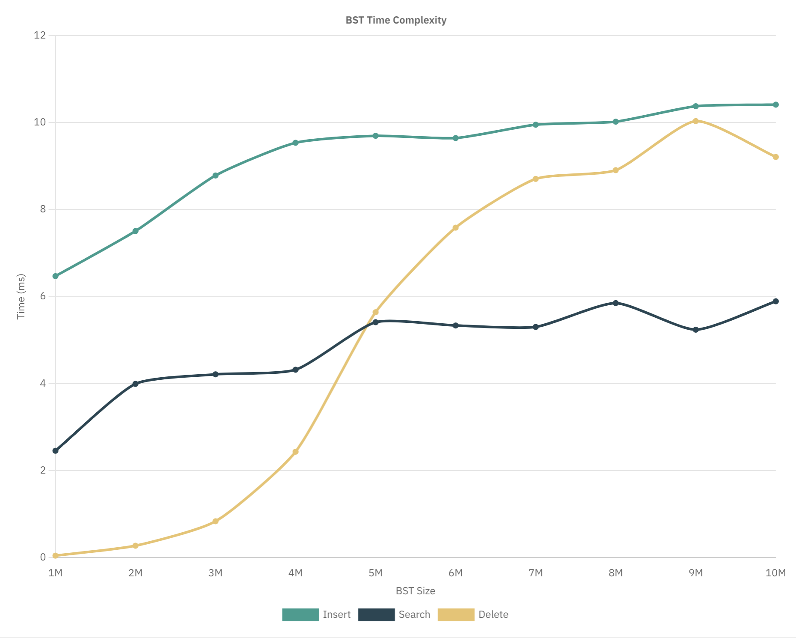
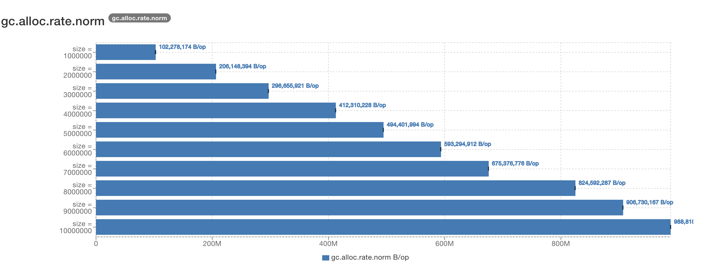
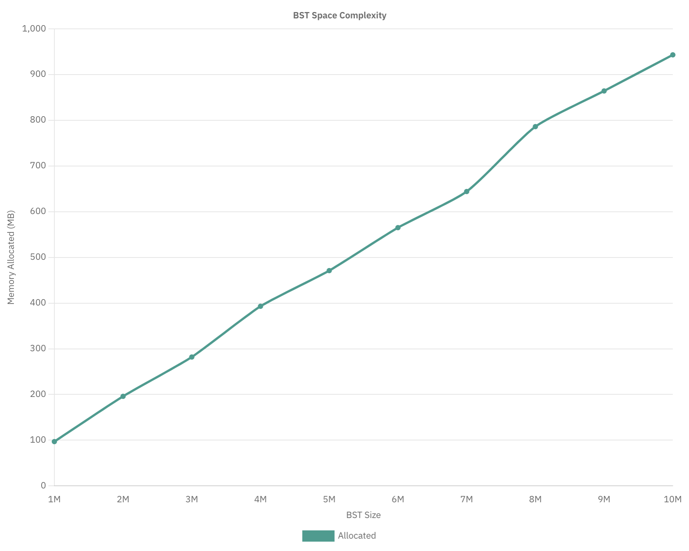

# HSA profiling

Java profilers with low performance overhead (~ 1%)

1. [Async Profiler](https://github.com/async-profiler/async-profiler)
2. [Java Mission Control](https://github.com/openjdk/jmc)
3. [Java Microbenchmark Harness (JMH)](https://github.com/openjdk/jmh)

Resources

1. [Open source profilers](https://www.infoq.com/articles/open-source-java-profilers/)
2. [Async profiler guide](https://krzysztofslusarski.github.io/2022/12/12/async-manual.html)
3. [JMH Samples](https://github.com/Valloric/jmh-playground/tree/master/src/jmh/java/org/openjdk/jmh/samples)
4. [JMH Visualizer](https://jmh.morethan.io/)

<h3>Task</h3>

- Implement Balanced Binary Search Tree class and operations of insert/delete/search
- Profile space usage ( Confirm that you see O(n) )
- Profile time consumption ( Confirm that you see O(log n))

<h3>Description</h3>

Measurements done using JMH and [IntelliJ IDEA JMH Plugin](https://github.com/artyushov/idea-jmh-plugin)

10K elements were inserted/searched/deleted for each iteration.

<h4>Time complexity</h4>

BST Insert
```
Benchmark                      (size)  Mode  Cnt   Score    Error  Units
BstTimeBenchmark.testInsert   1000000  avgt    3   6.469 ±  8.602  ms/op
BstTimeBenchmark.testInsert   2000000  avgt    3   7.505 ±  5.032  ms/op
BstTimeBenchmark.testInsert   3000000  avgt    3   8.782 ±  9.293  ms/op
BstTimeBenchmark.testInsert   4000000  avgt    3   9.534 ±  8.354  ms/op
BstTimeBenchmark.testInsert   5000000  avgt    3   9.694 ±  7.556  ms/op
BstTimeBenchmark.testInsert   6000000  avgt    3   9.642 ±  5.644  ms/op
BstTimeBenchmark.testInsert   7000000  avgt    3   9.949 ±  8.886  ms/op
BstTimeBenchmark.testInsert   8000000  avgt    3  10.019 ±  8.911  ms/op
BstTimeBenchmark.testInsert   9000000  avgt    3  10.374 ±  2.868  ms/op
BstTimeBenchmark.testInsert  10000000  avgt    3  10.410 ± 23.556  ms/op
```

BST Search
```
Benchmark                      (size)  Mode  Cnt  Score   Error  Units
BstTimeBenchmark.testSearch   1000000  avgt    3  2.457 ± 6.493  ms/op
BstTimeBenchmark.testSearch   2000000  avgt    3  3.994 ± 6.744  ms/op
BstTimeBenchmark.testSearch   3000000  avgt    3  4.213 ± 4.708  ms/op
BstTimeBenchmark.testSearch   4000000  avgt    3  4.319 ± 2.906  ms/op
BstTimeBenchmark.testSearch   5000000  avgt    3  5.410 ± 1.080  ms/op
BstTimeBenchmark.testSearch   6000000  avgt    3  5.335 ± 7.195  ms/op
BstTimeBenchmark.testSearch   7000000  avgt    3  5.302 ± 1.725  ms/op
BstTimeBenchmark.testSearch   8000000  avgt    3  5.850 ± 7.217  ms/op
BstTimeBenchmark.testSearch   9000000  avgt    3  5.239 ± 9.001  ms/op
BstTimeBenchmark.testSearch  10000000  avgt    3  5.891 ± 2.182  ms/op
```

BST Delete
```
Benchmark                      (size)  Mode  Cnt   Score    Error  Units
BstTimeBenchmark.testDelete   1000000  avgt    3   0.047 ±  0.050  ms/op
BstTimeBenchmark.testDelete   2000000  avgt    3   0.275 ±  7.409  ms/op
BstTimeBenchmark.testDelete   3000000  avgt    3   0.836 ± 23.502  ms/op
BstTimeBenchmark.testDelete   4000000  avgt    3   2.435 ± 43.508  ms/op
BstTimeBenchmark.testDelete   5000000  avgt    3   5.640 ± 47.446  ms/op
BstTimeBenchmark.testDelete   6000000  avgt    3   7.584 ± 27.751  ms/op
BstTimeBenchmark.testDelete   7000000  avgt    3   8.704 ± 10.085  ms/op
BstTimeBenchmark.testDelete   8000000  avgt    3   8.904 ±  1.306  ms/op
BstTimeBenchmark.testDelete   9000000  avgt    3  10.032 ±  4.987  ms/op
BstTimeBenchmark.testDelete  10000000  avgt    3   9.208 ±  9.403  ms/op
```

Collected results



<h4>Space complexity</h4>

Run benchmarks with option ``-prof gc -rf json`` to profile and output result in json file.

```
Benchmark                                           (size)  Mode  Cnt          Score         Error   Units
BstMemoryBenchmark.testMemory                      1000000  avgt    3        365.178 ±     317.773   ms/op
BstMemoryBenchmark.testMemory:gc.alloc.rate        1000000  avgt    3        165.263 ±     148.281  MB/sec
BstMemoryBenchmark.testMemory:gc.alloc.rate.norm   1000000  avgt    3  102278174.031 ± 4909693.673    B/op
BstMemoryBenchmark.testMemory:gc.count             1000000  avgt    3         69.000                counts
BstMemoryBenchmark.testMemory:gc.time              1000000  avgt    3       2265.000                    ms
BstMemoryBenchmark.testMemory                      2000000  avgt    3       1006.343 ±     265.819   ms/op
BstMemoryBenchmark.testMemory:gc.alloc.rate        2000000  avgt    3        126.980 ±      64.573  MB/sec
BstMemoryBenchmark.testMemory:gc.alloc.rate.norm   2000000  avgt    3  206148393.905 ±  171428.299    B/op
BstMemoryBenchmark.testMemory:gc.count             2000000  avgt    3         31.000                counts
BstMemoryBenchmark.testMemory:gc.time              2000000  avgt    3       1692.000                    ms
BstMemoryBenchmark.testMemory                      3000000  avgt    3       1696.098 ±    1529.237   ms/op
BstMemoryBenchmark.testMemory:gc.alloc.rate        3000000  avgt    3        116.988 ±      87.966  MB/sec
BstMemoryBenchmark.testMemory:gc.alloc.rate.norm   3000000  avgt    3  296655920.667 ±  205257.510    B/op
BstMemoryBenchmark.testMemory:gc.count             3000000  avgt    3         43.000                counts
BstMemoryBenchmark.testMemory:gc.time              3000000  avgt    3       1827.000                    ms
BstMemoryBenchmark.testMemory                      4000000  avgt    3       2683.390 ±    3097.829   ms/op
BstMemoryBenchmark.testMemory:gc.alloc.rate        4000000  avgt    3        103.154 ±      98.308  MB/sec
BstMemoryBenchmark.testMemory:gc.alloc.rate.norm   4000000  avgt    3  412310228.444 ±  823078.616    B/op
BstMemoryBenchmark.testMemory:gc.count             4000000  avgt    3         29.000                counts
BstMemoryBenchmark.testMemory:gc.time              4000000  avgt    3       1669.000                    ms
BstMemoryBenchmark.testMemory                      5000000  avgt    3       3437.306 ±    6458.381   ms/op
BstMemoryBenchmark.testMemory:gc.alloc.rate        5000000  avgt    3        102.296 ±     188.710  MB/sec
BstMemoryBenchmark.testMemory:gc.alloc.rate.norm   5000000  avgt    3  494401993.778 ±   29334.104    B/op
BstMemoryBenchmark.testMemory:gc.count             5000000  avgt    3         39.000                counts
BstMemoryBenchmark.testMemory:gc.time              5000000  avgt    3       1978.000                    ms
BstMemoryBenchmark.testMemory                      6000000  avgt    3       4068.663 ±    7831.874   ms/op
BstMemoryBenchmark.testMemory:gc.alloc.rate        6000000  avgt    3        100.131 ±     164.612  MB/sec
BstMemoryBenchmark.testMemory:gc.alloc.rate.norm   6000000  avgt    3  593294912.000 ±  245948.020    B/op
BstMemoryBenchmark.testMemory:gc.count             6000000  avgt    3         31.000                counts
BstMemoryBenchmark.testMemory:gc.time              6000000  avgt    3       1887.000                    ms
BstMemoryBenchmark.testMemory                      7000000  avgt    3       5405.656 ±   18515.522   ms/op
BstMemoryBenchmark.testMemory:gc.alloc.rate        7000000  avgt    3         89.600 ±     267.623  MB/sec
BstMemoryBenchmark.testMemory:gc.alloc.rate.norm   7000000  avgt    3  675376776.000 ±  665186.335    B/op
BstMemoryBenchmark.testMemory:gc.count             7000000  avgt    3         31.000                counts
BstMemoryBenchmark.testMemory:gc.time              7000000  avgt    3       2289.000                    ms
BstMemoryBenchmark.testMemory                      8000000  avgt    3       5854.659 ±   11435.920   ms/op
BstMemoryBenchmark.testMemory:gc.alloc.rate        8000000  avgt    3         97.052 ±     206.370  MB/sec
BstMemoryBenchmark.testMemory:gc.alloc.rate.norm   8000000  avgt    3  824592286.667 ± 1386574.412    B/op
BstMemoryBenchmark.testMemory:gc.count             8000000  avgt    3         32.000                counts
BstMemoryBenchmark.testMemory:gc.time              8000000  avgt    3       2564.000                    ms
BstMemoryBenchmark.testMemory                      9000000  avgt    3       6959.540 ±    3473.918   ms/op
BstMemoryBenchmark.testMemory:gc.alloc.rate        9000000  avgt    3         89.578 ±      22.147  MB/sec
BstMemoryBenchmark.testMemory:gc.alloc.rate.norm   9000000  avgt    3  906730166.667 ±  799380.044    B/op
BstMemoryBenchmark.testMemory:gc.count             9000000  avgt    3         40.000                counts
BstMemoryBenchmark.testMemory:gc.time              9000000  avgt    3       3430.000                    ms
BstMemoryBenchmark.testMemory                     10000000  avgt    3       7566.543 ±   25368.211   ms/op
BstMemoryBenchmark.testMemory:gc.alloc.rate       10000000  avgt    3         93.926 ±     267.064  MB/sec
BstMemoryBenchmark.testMemory:gc.alloc.rate.norm  10000000  avgt    3  988810965.333 ± 1362899.692    B/op
BstMemoryBenchmark.testMemory:gc.count            10000000  avgt    3         30.000                counts
BstMemoryBenchmark.testMemory:gc.time             10000000  avgt    3       2236.000                    ms
```

Visualized ``gc.alloc.rate.norm`` value (memory allocated per operation)




Conclusions

- Insert/search/delete operations demonstrate time complexity O(log n)
- Memory allocation demonstrates space complexity O(n) 
